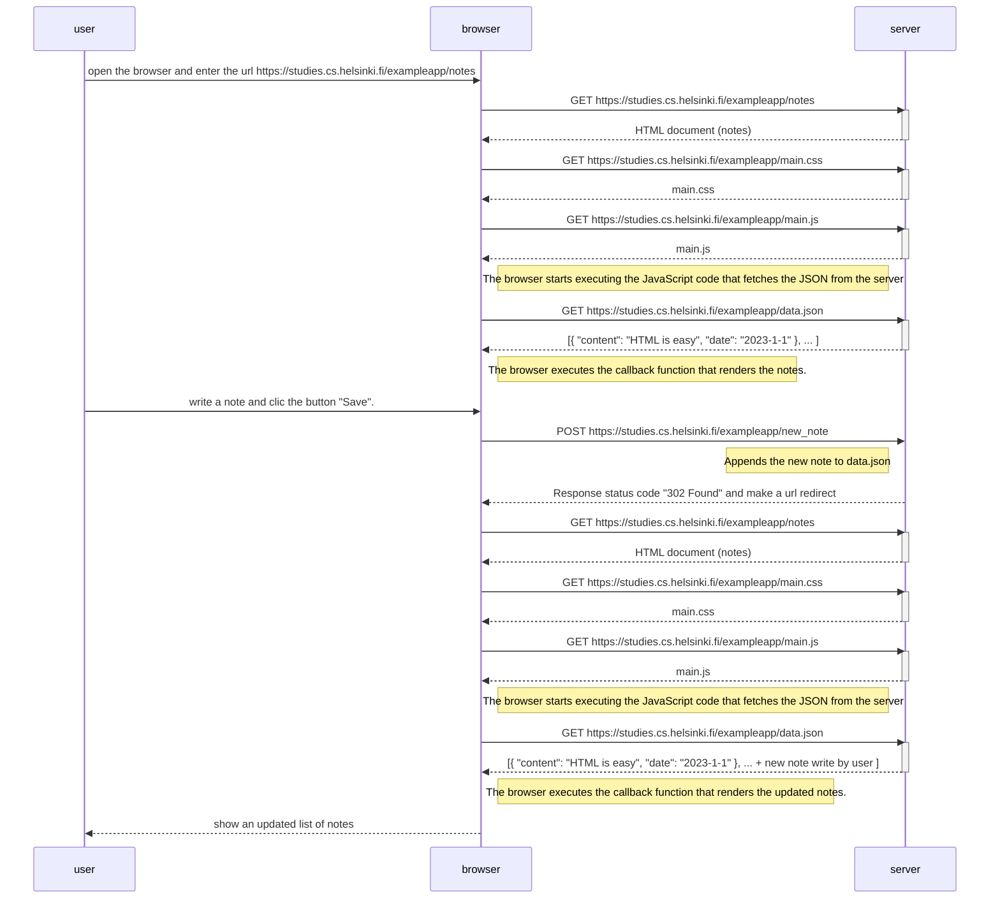

```mermaid
sequenceDiagram
    participant user
    participant browser
    participant server
    %% first load %%
    user->>browser: open the browser and enter the url https://studies.cs.helsinki.fi/exampleapp/notes 

    browser->>server: GET https://studies.cs.helsinki.fi/exampleapp/notes
    activate server
    server-->>browser: HTML document (notes)
    deactivate server

    browser->>server: GET https://studies.cs.helsinki.fi/exampleapp/main.css
    activate server
    server-->>browser: main.css
    deactivate server

    browser->>server: GET https://studies.cs.helsinki.fi/exampleapp/main.js
    activate server
    server-->>browser: main.js
    deactivate server

    Note right of browser: The browser starts executing the JavaScript code that fetches the JSON from the server

    browser->>server: GET https://studies.cs.helsinki.fi/exampleapp/data.json
    activate server
    server-->>browser: [{ "content": "HTML is easy", "date": "2023-1-1" }, ... ]
    deactivate server

    Note right of browser: The browser executes the callback function that renders the notes.

    %% Action: Create note%%
    user->>browser: write a note and clic the button "Save".

    browser->>server: POST https://studies.cs.helsinki.fi/exampleapp/new_note

    Note left of server: Appends the new note to data.json

    server-->>browser: Response status code "302 Found" and make a url redirect
    %% second load%
    browser->>server: GET https://studies.cs.helsinki.fi/exampleapp/notes
    activate server
    server-->>browser: HTML document (notes)
    deactivate server

    browser->>server: GET https://studies.cs.helsinki.fi/exampleapp/main.css
    activate server
    server-->>browser: main.css
    deactivate server

    browser->>server: GET https://studies.cs.helsinki.fi/exampleapp/main.js
    activate server
    server-->>browser: main.js
    deactivate server

    Note right of browser: The browser starts executing the JavaScript code that fetches the JSON from the server

    browser->>server: GET https://studies.cs.helsinki.fi/exampleapp/data.json
    activate server
    server-->>browser: [{ "content": "HTML is easy", "date": "2023-1-1" }, ... + new note write by user ]
    deactivate server

    Note right of browser: The browser executes the callback function that renders the updated notes.

    browser-->>user: show an updated list of notes
```