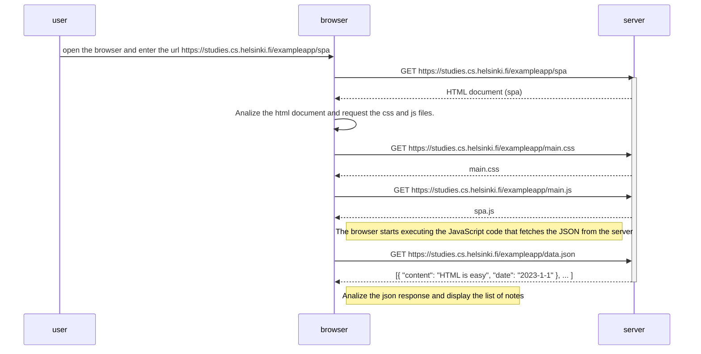

```mermaid
sequenceDiagram
    participant user
    participant browser
    participant server
    %% first load %%
    user->>browser: open the browser and enter the url https://studies.cs.helsinki.fi/exampleapp/spa

    browser->>server: GET https://studies.cs.helsinki.fi/exampleapp/spa
    activate server
    server-->>browser: HTML document (spa)

    browser->>browser: Analize the html document and request the css and js files.

    browser->>server: GET https://studies.cs.helsinki.fi/exampleapp/main.css
    
    server-->>browser: main.css

    browser->>server: GET https://studies.cs.helsinki.fi/exampleapp/main.js
    
    server-->>browser: spa.js

    Note right of browser: The browser starts executing the JavaScript code that fetches the JSON from the server

    browser->>server: GET https://studies.cs.helsinki.fi/exampleapp/data.json
    
    server-->>browser: [{ "content": "HTML is easy", "date": "2023-1-1" }, ... ]
    deactivate server

    Note right of browser: Analize the json response and display the list of notes
```